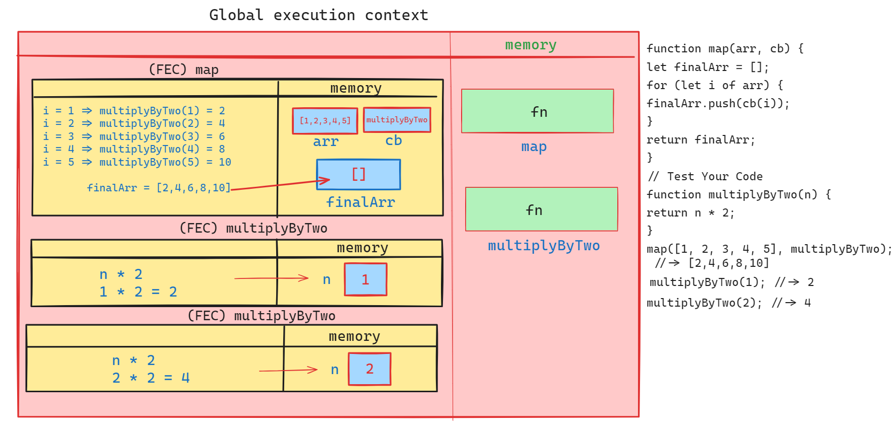
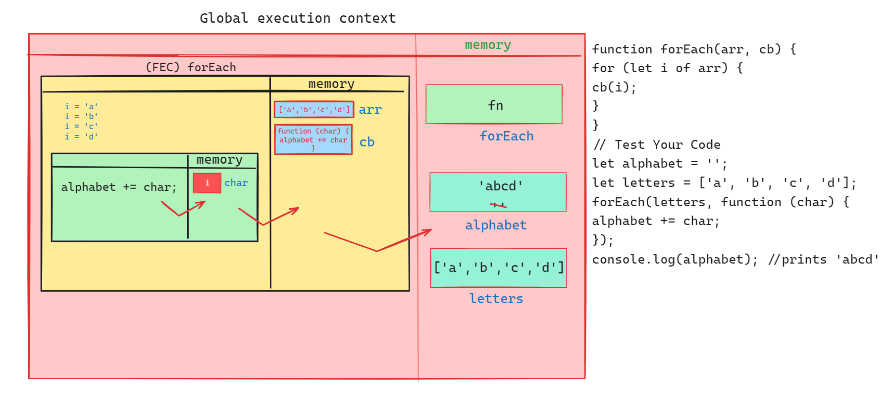

1. Create a function by your choice that accepts a callback function.

```js
function doubleArr(arr,double){
let newArr=[];
newArr.push(double(arr));
return newArr;
}

function double(n){
return n \* 2;
}
```

2. Create a function by you choice that returns a function reference.

```js
function doubleArr(){
function double(n){
return n \*2;

}
return double;
}
```

3. Create a higher order function called `map` that takes two inputs:-
   - An array of numbers/string/boolean etc
   - A 'callback' function - a function that is applied to each element of the array (inside of the function 'map')
   - Have `map` return a new array filled with values that are the result of the 'callback' function on each element of the input array.

```js
function map(arr, cb) {
  let finalArr = [];
  for (let i of arr) {
    finalArr.push(cb(i));
  }
  return finalArr;
}
// Test Your Code
function multiplyByTwo(n) {
  return n * 2;
}
map([1, 2, 3, 4, 5], multiplyByTwo); //-> [2,4,6,8,10]
multiplyByTwo(1); //-> 2
multiplyByTwo(2); //-> 4
```



4. Create a higher-order function called `forEach` taht takes an array and a callback, and runs the callback on each element of the array. `forEach` does not return anything.

```js
function forEach(arr, cb) {
  for (let i of arr) {
    cb(i);
  }
}
// Test Your Code
let alphabet = '';
let letters = ['a', 'b', 'c', 'd'];
forEach(letters, function (char) {
  alphabet += char;
});
console.log(alphabet); //prints 'abcd'
```



5. Create higher-order function called `filter` takes an array and a callback, and runs the callback on each element of the array if the return value of callback is `truthy` store in new array return the new array.

```js
// Test Your Code
function filter(arr, cb) {
  let finalArr = [];
  for (let i of arr) {
    if (cb(i) == true) {
      finalArr.push(i);
    }
  }
  return finalArr;
}

var numbers = [1, 3, 5, 4, 7, 89, 234, 20];
let even = filter(numbers, function (n) {
  return n % 2 === 0;
});
console.log(even); // [4,234,20]
let odd = filter(numbers, function (n) {
  return n % 2 !== 0;
});
console.log(odd); // [1,3,5,7,89]
```
